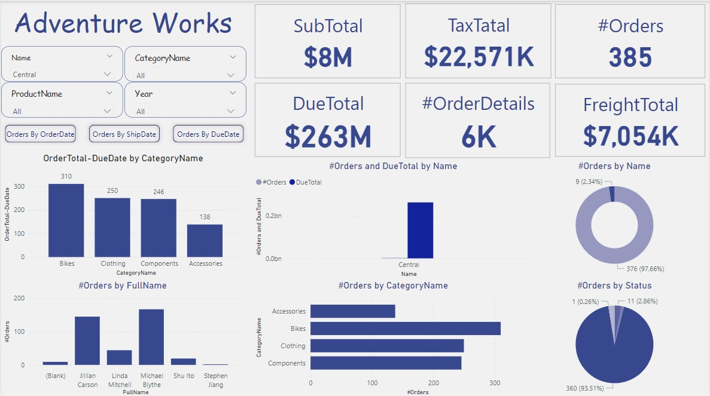

This dashboard, titled "Adventure Works," presents an overview of sales and order-related metrics. It includes several key performance indicators (KPIs) and visualizations to help analyze the business's performance:

KPIs (Top Section):

SubTotal: Displays total sales amounting to $8M.
TaxTotal: Shows total taxes collected at $22,571K.
DueTotal: Indicates the total amount due, which is $263M.
#Orders: Reflects the total number of orders, which is 385.
#OrderDetails: Counts the total number of order details, totaling 6K.
FreightTotal: Displays the total freight costs, which amount to $7,054K.
Filters (Top Left):

Users can filter the data by Name, CategoryName, ProductName, and Year.
Buttons allow switching between viewing orders by OrderDate, ShipDate, and DueDate.

Visualizations:

Bar Chart (Bottom Left):
Displays OrderTotal-DueDate by CategoryName. It shows the difference between the order total and due date for categories like Bikes, Clothing, Components, and Accessories.

Bar Chart (#Orders by FullName):
Shows the number of orders per customer name.
Bar Chart (#Orders and DueTotal by Name):
Highlights the total orders and due amounts for different customer names, with a specific focus on a "Central" name.

Bar Chart (#Orders by CategoryName):
Displays the total number of orders across different product categories, such as Accessories, Bikes, Clothing, and Components.

Donut Chart (#Orders by Name):
Breaks down orders by name, showing the percentage share of each name.

Donut Chart (#Orders by Status):
Illustrates the distribution of orders by their status, with a majority in one category.

The dashboard offers a comprehensive overview of the sales and order details, enabling users to analyze trends and performance across various dimensions like product categories, customer names, and order statuses.
